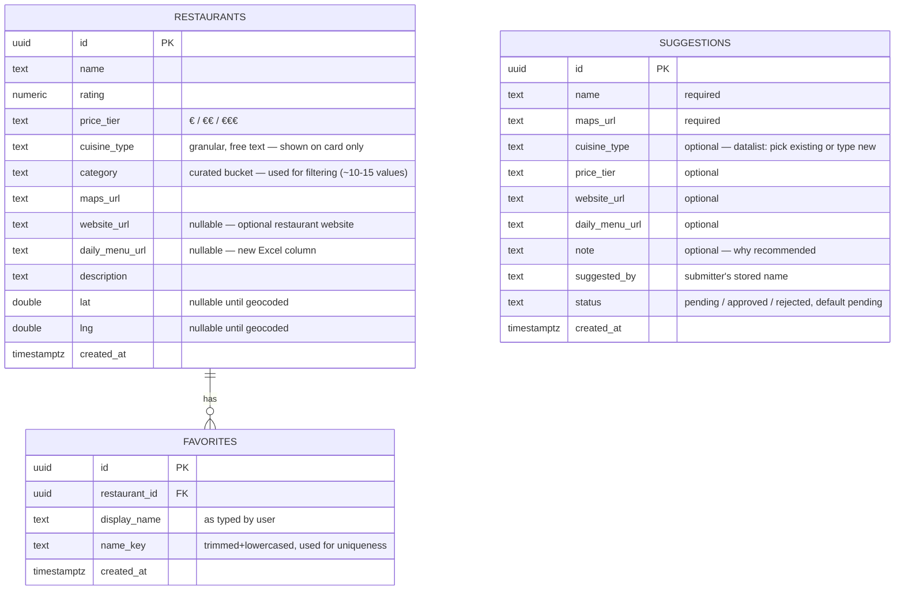

# Prague Restaurant Guide Web App (Tableau Replacement)

## Overview

Replace the existing Tableau Public dashboard with a small, free, modern web app that lists ~54 restaurants near the company's new Prague office (Olivova 2096/4, 110 00 Nové Město). The app adds features the Tableau version didn't have: an interactive map, better search/filtering, and a shared team "favorites" feature — while staying deliberately simple, since this is an internal fun project, not a product (see brainstorm: [docs/brainstorms/2026-07-16-tableau-to-webapp-brainstorm.md](../brainstorms/2026-07-16-tableau-to-webapp-brainstorm.md)).

Greenfield project — the working directory currently contains only the source spreadsheet (`Karel_Vaclavak_Prague_Restaurants_Guide.xlsx`) and the brainstorm doc. No existing code, `CLAUDE.md`, or `docs/solutions/` entries to follow, so this plan establishes the initial architecture from scratch.

## Problem Statement / Motivation

The old Tableau Public dashboard was built for the team's previous office location (Palmovka) and is slow to load, hard to extend, and tied to Tableau's UI. The company has since moved offices (Olivova 2096/4, Nové Město) and the underlying restaurant list has already been updated to reflect the new area. The Tableau dashboard should be treated only as a reference for *intent* (a curated, filterable restaurant guide for colleagues), not as a design or scope constraint (see brainstorm's "Resolved Questions": Tableau dashboard is inspiration only, not to be copied).

## Proposed Solution

A static frontend deployed to GitHub Pages, backed by a Supabase (Postgres) free-tier project for data storage. No custom backend server, no paid services, no real authentication.

> **Implementation note (2026-07-17):** during `/cde:work` we chose a **single static `index.html`** (no build step, no `node_modules`) over React + Vite. The prototype was already feature-complete as one file, and a build toolchain added plumbing without real benefit for a project of this size — this better matches the "maximum simplicity, fun project" goal. Leaflet and `@supabase/supabase-js` load from CDN; deploy is GitHub Pages "from a branch (root)". Everything else below stands.

- **Frontend:** ~~React + Vite~~ → **single static `index.html`** (see note above). The app's interactive state (filters, map/list sync, favorites) is handled with vanilla JS in one file.
- **Data:** Supabase Postgres, queried directly from the browser via `@supabase/supabase-js` using the public anon key. Three tables: `restaurants` (imported once from the Excel file), `favorites` (written to by users), and `suggestions` (colleague-submitted restaurant proposals awaiting admin approval).
- **Map:** Leaflet + OpenStreetMap tiles (no API key, no billing) — default view centered on Olivova 2096/4, Nové Město. The office itself gets a **visually distinct marker** (different shape + colour from the restaurant pins, legible in both light and dark themes) so it never blends in with the restaurant dots.
- **Distance from office:** each restaurant shows an estimated **walking time in minutes** from the office. Computed client-side from the office coordinates and the restaurant's geocoded `lat`/`lng` via the haversine (straight-line) distance, converted at ~80 m/min walking speed and labeled as an estimate ("~8 min pěšky"). No routing API (would add cost/complexity); straight-line is good enough for a lunch guide. Restaurants without coordinates simply omit the walk time.
- **Daily menu (denní menu):** the source Excel gains a new column for a daily-menu link. When a restaurant has it filled in, the card shows a "Denní menu" link/badge; when empty, nothing is shown. Optional, per-restaurant.
- **Website (web):** optional per-restaurant website link (`website_url`), shown as a secondary "Web" link/badge on the card when present. Also an optional field in the suggest-a-restaurant form.
- **Office marker:** rendered as a **larger azure "you are here" dot** (`#2f9bff`, bigger than the lime restaurant dots) with a soft pulsing ring — a plain dot. Azure was chosen deliberately: it reads as the universal map "your location" colour, harmonizes as a brightened sibling of the brand navy `#233347`, and is maximally distinct from both the lime restaurant dots and the rose selected/favorite highlight. Legible on both dark and light grounds.

- **Accent color system (three semantic hues):** lime `#a3fb66` = brand / active filters / restaurant dots; azure `#2f9bff` = office / "you are here"; rose `#f43f5e` = favorite (heart), currently-selected map dot, and required-field markers. Rose was chosen over the earlier orange-coral to complete a balanced triad with lime + azure and to read more unambiguously as "love/favorite".
- **Identity:** no password/email auth. Each person enters their name once; it's stored in `localStorage` and sent with each favorite toggle. This was an explicit brainstorm decision to avoid building/maintaining a real auth flow.
- **Colleague contributions (suggest-a-restaurant):** colleagues cannot write to the live `restaurants` list directly. Instead, a "Navrhnout podnik" form (name + Google Maps link required; cuisine, price tier, and a short note optional) inserts into a separate `suggestions` table, tagged with the submitter's stored name. The admin reviews suggestions in the Supabase Table Editor and manually copies approved ones into `restaurants`. This keeps colleagues contributing without exposing the curated list to public spam/vandalism via the anon key (decision made 2026-07-16, refining the brainstorm's original "admin-only data management" stance).
- **Admin/data editing:** no custom admin UI — restaurant data (and suggestion review/approval) is done directly via the Supabase Table Editor (already a full-featured spreadsheet-like UI, ships free with every Supabase project).
- **Geocoding:** source data has no coordinates, only Google Maps links. A one-time Node script geocodes each restaurant by `name + "Praha"` via OpenStreetMap Nominatim (free, rate-limited to 1 req/sec) and writes `lat`/`lng` into Supabase. The script is idempotent — it only geocodes rows still missing coordinates, so re-running it never clobbers manual corrections.

## Data Model (ERD)

`favorites` has a unique constraint on `(restaurant_id, name_key)` so the ❤️ toggle is a simple insert-if-absent / delete-if-present operation — no separate debounce logic needed, double-clicks just no-op on the second click.

`suggestions` is intentionally **not** linked by FK to `restaurants` — it's an inbox of proposals, not part of the curated data. Approval is a manual admin action in the Table Editor (read the row, create the corresponding `restaurants` row, set `status = approved`). No automatic promotion in the MVP; a Supabase SQL snippet or DB function to one-click promote an approved suggestion is a possible later convenience, not required now.

## Technical Considerations

- **Architecture impacts:** none — greenfield, no existing system to integrate with.
- **RLS (Row Level Security) — must be explicit, since the anon key is public in a static site:**
  - `restaurants`: anon role gets `SELECT` only. All writes happen through the Supabase dashboard (Table Editor), authenticated as the project owner — never exposed to the frontend.
  - `favorites`: anon role gets `SELECT`, `INSERT`, and `DELETE` (needed for the toggle-off case), but **no `UPDATE`**. There's no way to restrict `DELETE` to "your own" row without real auth — accepted as a low-stakes tradeoff consistent with the brainstorm's decision to skip real authentication for an internal fun project. Do not expose the `service_role` key anywhere in the frontend.
  - `suggestions`: anon role gets `INSERT` only — **no `SELECT`, `UPDATE`, or `DELETE`**. Colleagues can submit a proposal but cannot read the full suggestions inbox, edit, or delete entries. Review/approval happens only in the Supabase dashboard (owner-authenticated). This means the curated `restaurants` list is never writable from the frontend — the worst an abuser with the anon key can do is spam the `suggestions` inbox, which the admin simply ignores/deletes; the live guide stays clean.
  - Basic client-side validation on the name field (trim, 1–40 chars) and on the suggestion form (name + a URL-shaped Maps link required) to keep tables tidy; not a security boundary.
- **Performance:** trivial — 54 rows, no pagination needed, fetch entire dataset on load.
- **Security:** anon key is inherently public in a static-site + Supabase architecture; the mitigation is scoping what the anon key can do via RLS (above), not hiding the key.

### Assumptions made during planning (flag during `/cde:work` if any are wrong)

A SpecFlow analysis of the brainstorm surfaced several edge cases the brainstorm didn't address. Rather than re-opening brainstorming for each one, sensible defaults were chosen here — flag any of these during implementation if they don't match expectations:

- **First visit:** browsing, searching, and viewing the map does **not** require a name — the name prompt appears only the first time someone clicks ❤️.
- **Switching identity:** a small "Nie si [meno]? Zmeniť" link near the name lets someone reset the stored name (handles shared computers).
- **Name normalization:** `name_key` = trimmed + lowercased version of the entered name, used only for the uniqueness constraint; the original casing is still displayed.
- **Failed geocode:** restaurant stays visible in the list (with a small "poloha nenájdená" note) but has no map pin; fixed later via manual lat/lng entry in Supabase Table Editor.
- **Empty search/filter results:** show a simple "žiadne reštaurácie nevyhoveli filtru" empty state.
- **Supabase unreachable / write fails:** optimistic ❤️ toggle rolls back and shows a small non-blocking error message; no retry queue (keep it simple).
- **Restaurant deleted in Table Editor:** `favorites.restaurant_id` uses `ON DELETE CASCADE`, so orphaned favorite rows are cleaned up automatically.
- **Sorting:** column-header sorting — each sortable column (favorites ♥, name, walking distance, rating, price) has small **up/down arrow icons** in the header; clicking an arrow sorts by that column in that direction, and the active arrow is highlighted. Default is rating, descending. Ties break by rating. On mobile (where the column header is hidden) the same options are offered via a compact dropdown fallback. Sorting reorders the visible list.
- **Default theme:** **dark is the default** on first visit; a header toggle switches to light, and the choice persists in `localStorage`. Both themes are fully styled (JC lime works as an accent on both grounds).
- **Rating field:** treated as the existing Google Maps rating from the source spreadsheet — read-only, not recomputed from favorites.
- **Favorite counts:** refreshed on page load and after the viewer's own toggle; no live cross-user realtime sync in the MVP (a `postgres_changes` Supabase Realtime subscription would be a straightforward later addition, not required now).
- **Suggestion form — cuisine field:** rendered as a combo (existing cuisine values in a dropdown/`datalist` + free text to add a new one), so colleagues reuse existing categories where possible but aren't blocked from adding a new cuisine.
- **Cuisine filtering — scale to many values:** the source has ~42 distinct granular `cuisine_type` strings, far too many to expose as filters. The filter operates on a **curated `category` column** (~10–15 broad buckets like Česká, Japonská, Italská, Fine dining), kept separate from the granular `cuisine_type` (which stays for display on the card). The admin assigns `category` when adding/approving a restaurant in the Table Editor; unknown/new cuisines fall back to "Ostatní" until bucketed. Category chips are **ordered by frequency** and the long tail collapses behind a **"+ N dalších ▾" expander** (top ~8 shown by default), so the filter stays clean no matter how many categories exist. An active category in the long tail stays visible even when collapsed. (Rejected alternatives: filtering on 42 raw strings — unusable; a searchable multi-select dropdown — heavier UI than needed at this scale.)
- **Responsive layout:** list and map stack vertically on narrow/mobile screens, sit side-by-side on desktop — standard responsive pattern, no special design review needed given the brainstorm's "use your best web-design judgment" instruction.
- **Browser support:** current evergreen browsers only (Chrome/Edge/Firefox/Safari, last 2 versions, including mobile) — no legacy/IE support.
- **Visual identity:** styled in the Joyful Craftsmen brand — lime `#A3FB66` accent + navy `#233347`, geometric sans (Volte on the real site; approximated with a geometric system-font stack since Volte is proprietary and font CDNs are blocked in some contexts). Confirmed direction via the shared prototype.

## System-Wide Impact

- **Interaction graph:** User action (search/filter/❤️ click) → React state update → (for ❤️) Supabase REST call via `supabase-js` → Postgres row insert/delete in `favorites` → UI reflects new state optimistically, corrected on response.
- **Error propagation:** Supabase client errors (network failure, RLS rejection) surface as a small toast/banner; they don't crash the app. Initial data-fetch failure shows a full-page error state with a retry button instead of a blank screen.
- **State lifecycle risks:** the only persisted state is `restaurants` (owner-managed) and `favorites` (user-managed). Cascade delete (above) prevents orphaned rows. The geocoding script is the only other writer of `restaurants` and is idempotent by design.
- **API surface parity:** N/A — a single frontend talking to a single Supabase project is the only interface.
- **Integration test scenarios** (manual, since no test framework is planned for this scope):
  1. Fresh browser, no localStorage: browse, search, filter, view map — all work without being prompted for a name.
  2. Click ❤️ for the first time: name prompt appears, favorite saves, count increments, name persists across reload.
  3. Click ❤️ twice on the same restaurant: second click removes the favorite (toggle-off), no duplicate row created.
  4. Filter by a cuisine type with zero matches: empty state shown, no console errors.
  5. Restaurant with no lat/lng (geocode failed or pending): appears in list with the "poloha nenájdená" note, no pin/crash on the map.
  6. Simulate Supabase request failure (e.g. throttle network in devtools): ❤️ toggle rolls back with an error message instead of hanging.

## Acceptance Criteria

### Data & Backend
- [ ] Supabase project created; `restaurants`, `favorites`, and `suggestions` tables exist per the ERD above, with the `(restaurant_id, name_key)` unique constraint and `ON DELETE CASCADE` on `favorites` — *SQL ready in [`supabase/schema.sql`](../../supabase/schema.sql); user runs it in the SQL Editor (README step 1–2)*
- [ ] RLS policies applied exactly as specified (anon: `restaurants` read-only; `favorites` select/insert/delete, no update; `suggestions` insert-only) — *included in the same `schema.sql`; applied when the user runs it*
- [x] One-time import script (`scripts/import-restaurants.ts` or `.mjs`) loads all 54 rows from `Karel_Vaclavak_Prague_Restaurants_Guide.xlsx` into `restaurants`, including the new **daily-menu-link column** (mapped to `daily_menu_url`, left null when blank), the optional **website** column (`website_url`), and a derived **`category`** bucket for each row (seeded from the granular `cuisine_type` via a mapping table; unmapped → "Ostatní" for the admin to reassign)
- [x] One-time geocoding script (`scripts/geocode-restaurants.mjs`) fills `lat`/`lng` via Nominatim, respecting the 1 req/sec rate limit and a descriptive `User-Agent` header, and is safely re-runnable

### List / Search / Filter / Sort
- [x] All 54 restaurants render with name, rating, price tier (€/€€/€€€), cuisine type, description, a link to the original Google Maps entry, and an estimated **walking time from the office**
- [x] Restaurants with a `daily_menu_url` show a **"Denní menu" link/badge**; those without show nothing extra
- [x] Restaurants with a `website_url` show a **"Web" link/badge**; those without show nothing extra
- [x] Free-text search across name + description
- [x] Filters for cuisine **category** (curated buckets, frequency-ordered, long tail behind a "+ N dalších" expander), price tier (€/€€/€€€ multi-select), minimum rating, and **walking distance in minutes** (e.g. ≤5 / ≤10 / ≤15 min)
- [x] **Column-header sort** with up/down arrow icons per sortable column (♥ favorites, name, distance, rating, price); active direction highlighted; rating-desc default; compact dropdown fallback on mobile
- [x] Empty state shown when a filter/search yields no results

### Map
- [x] Leaflet map with OpenStreetMap tiles, default view centered on Olivova 2096/4, 110 00 Nové Město
- [x] **Office rendered as a larger azure dot** (`#2f9bff`, "you are here", bigger than the lime restaurant pins), clearly legible in both light and dark themes; a small legend labels office vs. restaurants
- [x] Pin per restaurant with successfully geocoded coordinates; restaurants without coordinates are omitted from the map but remain in the list
- [x] Clicking a pin shows the restaurant's name/rating/link (popup)

### Theme
- [x] Dark theme is the default on first visit; header toggle switches to light; choice persists across visits
- [x] Both themes are fully styled and legible (JC lime accent works on both grounds)

### Favorites / Identity
- [x] Name is requested only on first ❤️ click, not on page load
- [x] Name is stored in `localStorage` and reused on return visits
- [x] A visible control lets the user change/reset their stored name
- [x] ❤️ toggle is idempotent (on = insert, off = delete) and reflects the current team-wide count
- [x] "Show favorites only" filter works

### Suggest a restaurant (colleague contributions)
- [x] A visible "Navrhnout podnik" action opens a form with: name (required), Google Maps link (required), cuisine type (optional — combo/`datalist` of existing values + free text for a new one), price tier (optional), website link (optional), daily-menu link (optional), short note (optional)
- [x] Client-side validation blocks submit until name is non-empty and the link is URL-shaped
- [x] Submitting inserts one row into `suggestions` (tagged with the submitter's stored name and `status = pending`); a success confirmation is shown
- [x] Colleagues cannot read, edit, or delete suggestions from the frontend, and cannot write to `restaurants` (enforced by insert-only RLS)
- [x] Admin workflow documented: review `suggestions` in Supabase Table Editor → copy approved rows into `restaurants` → run geocoding for the new rows

### Deployment
- [x] Single static `index.html` (no build step — decision changed from React+Vite to a single static file for max simplicity); deploy via GitHub Pages "Deploy from a branch" (root). *(User step: push repo + enable Pages.)*
- [x] All asset/library references work under a project subpath (relative paths + CDN for Leaflet/supabase-js); no base-path build config needed
- [x] Supabase anon key (public by design) is the only credential in the frontend; `service_role` key lives only in `scripts/.env` (gitignored), never in `index.html` or the repo

## Success Metrics

Informal, matching the "fun project" scope:
- App is reachable at a GitHub Pages URL and loads in under ~2 seconds on a normal connection
- All 54 restaurants display correctly with working Google Maps links
- At least ~90% of restaurants have an accurate map pin after the one-time geocoding pass (remainder fixed manually)
- The team actually uses the ❤️ favorites feature after a couple of weeks (qualitative — worth checking back on)

## Dependencies & Risks

- **Nominatim usage policy:** free tier requires ≤1 request/second and a descriptive `User-Agent`; fine for a one-time 54-row batch job, no ongoing dependency
- **Supabase free tier limits:** far exceed what an internal team of this size needs (500MB DB, generous request limits) — low risk
- **No real authentication:** accepted trade-off (see brainstorm) — anyone with the anon key can technically impersonate a name or spam favorites; mitigated only by RLS scoping, not by identity verification. Acceptable given the internal, low-stakes nature of the tool.
- **GitHub Pages is 100% static:** any future feature needing server-side logic (e.g. scheduled jobs, secrets) would need a different backend — not a concern for the current scope

## Sources & References

### Origin
- **Brainstorm document:** [docs/brainstorms/2026-07-16-tableau-to-webapp-brainstorm.md](../brainstorms/2026-07-16-tableau-to-webapp-brainstorm.md) — key decisions carried forward: (1) GitHub Pages + Supabase free-tier architecture chosen over a "pure static, no DB" or paid alternative; (2) name-only identity (no password/email) instead of full auth; (3) Supabase Table Editor as the admin interface instead of custom-built CRUD UI; (4) app targets the new office at Olivova 2096/4, Nové Město, not the old Palmovka location; (5) design is not constrained by the original Tableau dashboard's look.

### Internal References
- Source data: `Karel_Vaclavak_Prague_Restaurants_Guide.xlsx` (54 rows: `Název`, `Rating`, `Cena`, `Typ kuchyně`, `Odkaz`, `Popis`)

### External References
- Supabase Row Level Security docs (for the `restaurants`/`favorites` policies above)
- Leaflet + OpenStreetMap tile usage (no API key required)
- Nominatim usage policy (1 req/sec rate limit, `User-Agent` requirement)
- Vite "Deploying to GitHub Pages" guide (`base` config + GitHub Actions)

### Related Work
- Predecessor being replaced: [Tableau Public dashboard](https://public.tableau.com/app/profile/rado.zatovic/viz/REATURANTGUIDEFOROFFICEPEOPLEOFPALMOVKAPRAGUE/RESTAURANTS) (reference/inspiration only, not to be copied)
